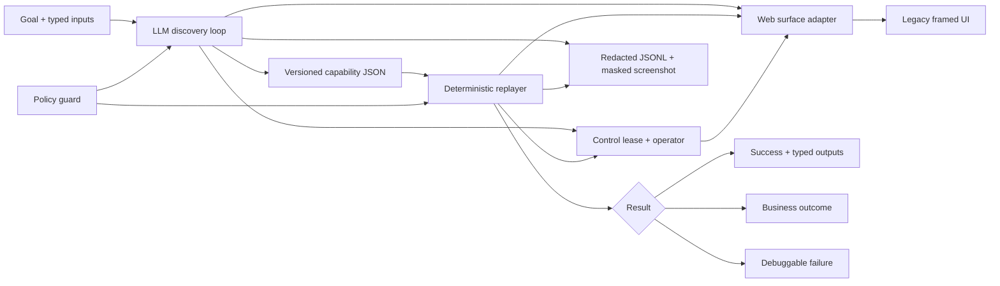

# Computer-Use Capability Runner

A focused vertical slice of an automation system that lets a model discover a task in a legacy UI once, records the successful run as a typed capability, and replays it deterministically without a model in the loop.

The included target is **Meridian Core 2004**, a local, synthetic banking proxy with a frameset, table layout, minimal semantics, runtime dialogs, and no test IDs. It never uses real credentials or PII.

## What is implemented



- A genuine observe-decide-act loop using Groq Chat Completions, OpenAI Responses, or the Codex CLI. A scripted provider exists only for offline tests and is labeled in provenance.
- A deliberately versioned, JSON-Schema-validated capability contract with typed inputs/outputs, parameterized actions, locator bundles, exception rules, checkpoint, policy, compatibility metadata, and provenance.
- Deterministic replay with no model dependency or model call. Locator resolution requires one visible match and tries semantic strategies before structural fallbacks.
- Distinct `success`, `business_outcome`, and `failure` results.
- Explicit runtime handling for not-found, a bounded session-expiry recovery, permission denial, and operator verification.
- A real same-session human handoff: automation pauses, an epoch-based control lease moves to the operator, their DOM actions are captured, and the lease returns to automation.
- Origin, route, and action allowlists. Browser requests are intercepted before navigation or submission can leave the boundary. Risky actions require an explicit approve/reject decision tied to the proposed action; pressing Enter only resumes ordinary manual handoffs.
- JSONL events, masked screenshots, and subtree redaction. Raw model transcripts and chain-of-thought are not stored.
- Tenant specialization through optional entrypoint and per-step locator overrides on a shared vendor artifact.

## Prerequisites and setup

- Node.js 20 or newer
- Google Chrome installed (override with `CHROME_CHANNEL` if needed)
- For a genuine discovery run, either:
  - `GROQ_API_KEY` and optional `GROQ_MODEL` (defaults to `openai/gpt-oss-20b`),
  - `OPENAI_API_KEY` and optional `OPENAI_MODEL`, or
  - an authenticated `codex` CLI and optional `CODEX_BIN`

```bash
cd computer-use-automation-system
npm ci
npm run check
npm test
```

No live service or key is needed for tests, replay, or the offline discovery fixture. `.env.example` lists optional configuration; `.env` is ignored.

## Demo path

### 1. Genuine model-driven discovery

With Groq Chat Completions:

```bash
GROQ_API_KEY=... npm run discover -- \
  --with-demo \
  --provider groq \
  --inputs '{"memberId":"12345"}' \
  --artifact artifacts/lookup-member-balance.v1.json
```

Or with OpenAI Responses:

```bash
OPENAI_API_KEY=... npm run discover -- \
  --with-demo \
  --provider openai \
  --inputs '{"memberId":"12345"}' \
  --artifact artifacts/lookup-member-balance.v1.json
```

Or with an authenticated Codex CLI:

```bash
CODEX_BIN=codex npm run discover -- \
  --with-demo \
  --provider codex \
  --inputs '{"memberId":"12345"}' \
  --artifact artifacts/lookup-member-balance.v1.json
```

The runner starts the local UI, feeds compact observations to the selected model, policy-checks each decision, acts in the browser, verifies the checkpoint, validates the artifact against `schema/capability.schema.json`, and writes run evidence under `runs/`.

### 2. Deterministic replay

```bash
npm run replay -- \
  --with-demo \
  --artifact artifacts/lookup-member-balance.v1.json \
  --inputs '{"memberId":"12345"}'
```

This command loads only the saved artifact and input values. It does not construct a model provider and cannot call a model.

### 3. Offline discovery fixture

For reviewers without model access:

```bash
npm run discover -- \
  --with-demo \
  --provider scripted \
  --inputs '{"memberId":"12345"}' \
  --artifact artifacts/lookup-member-balance.v1.json
```

This exercises the same observer, policy, recorder, browser, schema, and replay seams, but it is explicitly `scripted-offline` in the artifact provenance. It is not presented as the required LLM run.

## Exercise the outcome taxonomy

After producing an artifact, replace the input in the replay command with one of these synthetic records:

| Member ID | Expected result |
|---|---|
| `12345` | Success; returns `{currency: "USD", amountMinor: 428173}` to the caller |
| `99999` | `business_outcome` / `MEMBER_NOT_FOUND` |
| `55555` | Session-expiry dialog is recovered once, then success |
| `88888` | Hard `PERMISSION_DENIED` failure with a masked screenshot |
| `77777` | Human verification handoff, then success |

For the manual handoff, launch a headed browser from an interactive terminal:

```bash
npm run replay -- \
  --with-demo \
  --headed \
  --artifact artifacts/lookup-member-balance.v1.json \
  --inputs '{"memberId":"77777"}'
```

Automation pauses on the verification dialog. Complete it in that same Chrome window and press Enter in the terminal. `intervention.json` and the event log preserve the control transfer and sanitized operator actions.

Use `--headed --handoff-on-failure` to route an otherwise unknown read-only extraction failure through the same mechanism before one final attempt. A click, type, or navigation whose effect is uncertain is never blindly repeated.

## Evidence

[`evidence/`](evidence/) contains:

- a capability emitted by a genuine `codex-cli` discovery run;
- the discovery JSONL and masked success screenshot;
- deterministic success, known business outcome, bounded recovery, hard failure, and human-handoff replay runs.

Each replay starts with `modelCallsAllowed: false`. The discovery provider and model identity are recorded in both the event log and artifact provenance. See [`evidence/README.md`](evidence/README.md) for the index and regeneration commands.

## Repository map

```text
src/agent/        model providers and discovery recorder
src/domain/       artifact and result types, schema validation
src/surface/      Playwright-backed observe/act/checkpoint adapter
src/replay/       deterministic state machine and error taxonomy
src/policy/       allowlist and risk enforcement
src/handoff/      same-session control lease and action capture
src/infra/        redacted evidence writer
src/demo/         synthetic legacy application
schema/           model decision and capability JSON Schemas
examples/         discovery specification
evidence/         reviewed, synthetic example runs
tests/            browser-level vertical-slice tests
```

## Security notes

- Secrets belong in the environment and are never serialized into an artifact.
- Input values are parameter references in the artifact, not literals.
- Evidence events redact secrets, identifiers, amounts, and sensitive subtrees. Screenshots mask configured selectors.
- The OpenAI Responses provider sends `store: false`. The Groq provider uses direct Chat Completions with strict structured output. Deployment retention and transport policy must still be reviewed for either endpoint.
- The model necessarily sees the live observation during discovery. A production deployment must use an institution-approved model endpoint, transport, retention policy, and tenant isolation. Replay does not expose data to a model.
- The demo evidence is safe to commit because every record is synthetic. Runtime evidence from a real institution should go to encrypted, access-controlled storage with retention limits and should never be committed.

## Verification

```bash
npm run check
npm test
npm run build
```

The browser suite covers artifact parameterization/schema validation, model-free success, business not-found, bounded recovery, hard failure evidence, same-session handoff, and policy blocking.

See [`REPORT.md`](REPORT.md) for the design decisions, trade-offs, and cut lines.
